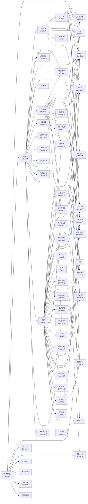

```mermaid
flowchart LR
phatpsy["PHATPSY\n(main.f)"]
bomb["BOMB\n(bomb.f)"]
contrl["CONTRL\n(contrl.f)"]
aloop["ALOOP\n(aloop.f)"]
bloop["BLOOP\n(bloop.f)"]
ctsc["CTSC\n(ctsc.f)"]
insrtd["INSRTD\n(insrtd.f)"]
scmult["SCMULT\n(scmult.f)"]
arrmap["ARRMAP\n(arrmap.f)"]
to["TO"]
atomic["ATOMIC\n(atomic.f)"]
derase["DERASE\n(erase.f)"]
dump["DUMP"]
ewmo["EWMO\n(ewmo.f)"]
dcopy["DCOPY\n(dcopy.f)"]
dmpab["DMPAB\n(dmpab.f)"]
eispak["EISPAK\n(eispak.f)"]
excite["EXCITE\n(excite.f)"]
lowdin["LOWDIN\n(lowdin.f)"]
normlz["NORMLZ\n(normlz.f)"]
outvec["OUTVEC\n(outvec.f)"]
popout["POPOUT\n(popout.f)"]
putone["PUTONE\n(putone.f)"]
timout["TIMOUT\n(timout.f)"]
genbc["GENBC\n(genbc.f)"]
gencgc["GENCGC\n(gencgc.f)"]
genfac["GENFAC\n(genfac.f)"]
ms_map["MS_MAP"]
putcgc["PUTCGC\n(putcgc.f)"]
scf["SCF\n(scf.f)"]
addmat["ADDMAT\n(addmat.f)"]
analys["ANALYS\n(analys.f)"]
denmat["DENMAT\n(denmat.f)"]
dmpatb["DMPATB\n(dmpatb.f)"]
esca["ESCA\n(esca.f)"]
flip["FLIP\n(flip.f)"]
fokmat["FOKMAT\n(fokmat.f)"]
maxovl["MAXOVL\n(maxovl.f)"]
neword["NEWORD\n(neword.f)"]
plotv["PLOTV\n(plotv.f)"]
punchv["PUNCHV\n(punchv.f)"]
putmat["PUTMAT\n(outvec.f)"]
submat["SUBMAT\n(addmat.f)"]
symop["SYMOP\n(symop.f)"]
trisq["TRISQ\n(trisq.f)"]
uthu["UTHU\n(uthu.f)"]
warn["WARN"]
xyzmap["XYZMAP\n(xyzmap.f)"]
depth["DEPTH\n(depth.f)"]
getset["GETSET\n(timout.f)"]
ierase["IERASE\n(erase.f)"]
ms_get["MS_GET"]
ms_put["MS_PUT"]
qerase["QERASE\n(erase.f)"]
setbom["SETBOM"]
phatpsy --> bomb
phatpsy --> contrl
phatpsy --> derase
phatpsy --> getset
phatpsy --> ierase
phatpsy --> ms_get
phatpsy --> ms_put
phatpsy --> qerase
phatpsy --> setbom
contrl --> aloop
contrl --> arrmap
contrl --> atomic
contrl --> bomb
contrl --> derase
contrl --> dump
contrl --> ewmo
contrl --> genbc
contrl --> gencgc
contrl --> genfac
contrl --> ms_map
contrl --> outvec
contrl --> putcgc
contrl --> putone
contrl --> scf
contrl --> timout
contrl --> xyzmap
aloop --> bloop
aloop --> bomb
aloop --> ctsc
aloop --> insrtd
aloop --> scmult
bloop --> addmat
bloop --> ctsc
bloop --> dmpab
bloop --> dmpatb
bloop --> putmat
bloop --> putone
bloop --> scmult
arrmap --> to
ewmo --> arrmap
ewmo --> bomb
ewmo --> ctsc
ewmo --> dcopy
ewmo --> derase
ewmo --> dmpab
ewmo --> eispak
ewmo --> excite
ewmo --> lowdin
ewmo --> normlz
ewmo --> outvec
ewmo --> popout
ewmo --> putone
ewmo --> timout
timout --> to
scf --> addmat
scf --> analys
scf --> bomb
scf --> ctsc
scf --> dcopy
scf --> denmat
scf --> dmpab
scf --> dmpatb
scf --> eispak
scf --> esca
scf --> flip
scf --> fokmat
scf --> lowdin
scf --> maxovl
scf --> neword
scf --> normlz
scf --> outvec
scf --> plotv
scf --> punchv
scf --> putmat
scf --> putone
scf --> scmult
scf --> submat
scf --> symop
scf --> timout
scf --> trisq
scf --> uthu
scf --> warn
analys --> derase
analys --> lowdin
analys --> putone
analys --> warn
fokmat --> derase
maxovl --> ierase
neword --> dcopy
symop --> bomb
symop --> dcopy
xyzmap --> depth
```